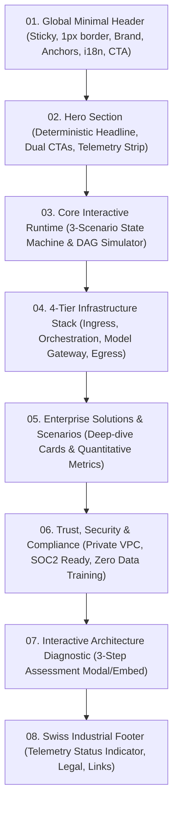

# System Specification: Selyron B2B Automation Infrastructure Platform

> **Target Branch**: `feat/b2b-infrastructure-white`  
> **Date**: 2026-10-08  
> **Status**: Ready for Human Partner Review  
> **Aesthetic Class**: Linear / Stripe / Resend — Minimalist, Restrained, Pure White, High-Density B2B Infrastructure  

---

## 1. Executive Summary & Brand Positioning

### 1.1 Brand & Product Identity
- **Entity**: Selyron Systems (`Selyron Autonomous Enterprise Infrastructure`)
- **Category**: B2B Enterprise Automation Infrastructure & Forward-Deployed Engineering.
- **Core Value Proposition**: Deterministic, auditable, and human-in-the-loop automation runtime for mission-critical enterprise workflows across legacy ERPs, distributed databases, and generative foundation models.
- **Tone of Voice**: Understated, precise, sovereign, and deeply grounded in engineering rigor. Zero generic marketing clichés (no "magical AI", no rainbow gradients, no hyperbolic promises).

### 1.2 Target Audience (Dual-Track Persona)
1. **Technical Decision Makers (CTO, VP of Engineering, Lead Architects)**:
   - Prioritize: Execution determinism (99.99%), state persistence, idempotency locks, atomic rollbacks, private VPC / on-premise air-gapped readiness, and latency telemetry.
2. **Operations & Executive Leadership (COO, VP of Operations, Business Unit Directors)**:
   - Prioritize: End-to-end outcome accountability, non-standard document reconciliation, legacy ERP integration (SAP / Oracle / Kingdee), human-in-the-loop compliance, and ROI quantification.

---

## 2. Design System & Visual Materiality Tokens

### 2.1 Color Palette (Monochrome Strict + Semantic Status Lights)
The visual foundation is clean, sharp, and restrained:
- **Canvas / Primary Background**: `#FFFFFF` (Pure White)
- **Sub-surface / Card Background**: `#F8FAFC` (Slate-50) / `#F9FAFB` (Gray-50)
- **Hairline Borders**: `1px solid #E2E8F0` (Slate-200) / `#E5E7EB` (Gray-200)
- **Primary Text**: `#09090B` (Zinc-950) — High contrast, razor-sharp readability
- **Secondary Text**: `#52525B` (Zinc-600) — Descriptive copy, technical notes
- **Muted Text / Metadata**: `#A1A1AA` (Zinc-400) — Telemetry timestamps, step indices
- **Semantic Status Accents** (strictly localized to indicators and execution nodes):
  - **Running / Active**: `#10B981` (Emerald-500) with subtle pulsing indicator
  - **Awaiting Approval / HITL**: `#F59E0B` (Amber-500)
  - **Error / Auto-Recovery**: `#EF4444` (Rose-500)
  - **Idle / Queued**: `#64748B` (Slate-500)

### 2.2 Typography & Scale
- **Headings & Body**: `Inter`, `Geist Sans`, or system sans-serif (`-apple-system, BlinkMacSystemFont, "Segoe UI", Roboto`) with tight letter-spacing (`tracking-tight`).
- **Telemetry, Code & Badges**: `JetBrains Mono`, `Geist Mono`, `ui-monospace` for latency figures, status badges, node execution IDs, and JSON payloads.
- **Rules**:
  - No all-caps shout headings.
  - Strict line-length limits (< 72 characters on descriptive paragraphs).
  - Consistent 1px border dividers rather than decorative box shadows.

### 2.3 Micro-Interactions & Restraint
- **Zero Heavy 3D Bloat**: Eliminate GPU-heavy synaptic meshes and continuous oscillator loops that consume excessive battery or distract from engineering content.
- **Tactile State Machine Feedback**: Instantaneous node status transitions, crisp hover borders (`border-zinc-400` on hover), and interactive JSON inspector toggles.

---

## 3. Information Architecture & Page Structure

The single-page flagship website follows a rigorously sequenced narrative flow:

### 3.1 Component Breakdown

#### Section 01: Global Minimal Header (`Navbar.tsx`)
- Left: Selyron brand mark + monospaced badge `[INFRASTRUCTURE // CORE]`.
- Center: Anchor links (`Runtime`, `Architecture`, `Use Cases`, `Security`).
- Right:
  - Language toggle (`EN / 中`) with zero-latency client state synchronization.
  - Primary button: `Schedule Architecture Review` (triggers Diagnostic Modal).

#### Section 02: Hero Section (`HeroSection.tsx`)
- **Badge**: Monospaced micro-pill: `v2.4 DETERMINISTIC EXECUTION RUNTIME`.
- **Primary Title**:
  - *EN*: Deterministic Automation for the Enterprise Core.
  - *ZH*: 确定性企业级自动化核心基础设施。
- **Subtitle**: High-density explanation of how Selyron orchestrates stateful, zero-silent-failure workflows across legacy ERPs, internal systems, and foundation models.
- **Action Group**:
  - Primary: `Start Architecture Assessment` (opens diagnostic modal).
  - Secondary: `Inspect Live DAG Engine` (smooth scrolls directly into Interactive Runtime).
- **Telemetry Strip**:
  - `99.99% Execution Determinism`
  - `<120ms Gateway Latency`
  - `Zero Silent Failures`
  - `Private VPC & Air-Gap Ready`

#### Section 03: Core Interactive Runtime (`InteractiveDagRunner.tsx`)
The centerpiece engineering proof of the platform.
- **Scenario Selector Tabs**:
  1. `SCENARIO 01: Multimodal Document Ingestion & ERP Reconciliation`
  2. `SCENARIO 02: Cross-System Event Ingress & Human-in-the-Loop (HITL) Gate`
  3. `SCENARIO 03: Multi-Model Gateway & Immutable Audit Ledger`
- **DAG Canvas**:
  - Minimal light-grey grid canvas (`bg-slate-50/50`).
  - Sequence of discrete execution nodes with real-time state (`Queued`, `Processing`, `Awaiting Sign-off`, `Completed`).
  - Interactive controls: `Run Pipeline`, `Step Forward`, `Reset`, and `Authorize Human Approval`.
- **Telemetry & Payload Inspector**:
  - Displays real-time memory footprint, latency per node, retry count, and formatted JSON data payload.

#### Section 04: 4-Tier Infrastructure Stack (`InfrastructureStack.tsx`)
Four clean, high-density structural columns or stacked cards:
1. **Tier 1: Event Ingress & Ingestion**: Webhooks, SFTP, unstructured PDF/Scan OCR, message queues (Kafka, RabbitMQ) with rate limiting and deduplication.
2. **Tier 2: Stateful Orchestration Core**: DAG state machine, idempotency locks, exponential backoff retries, human-in-the-loop state suspension.
3. **Tier 3: Multi-Model Gateway & Semantic Routing**: Low-latency model routing (DeepSeek, Claude, GPT, local Llama), PII masking, token caching.
4. **Tier 4: Enterprise Egress & Ledger**: Two-phase commit into SAP/Kingdee/Salesforce, immutable SHA-256 audit logs.

#### Section 05: Enterprise Solutions & Scenarios (`EnterpriseScenarios.tsx`)
Concrete B2B application archetypes:
- **Financial & Supply Chain Reconciliation**: Automatic 3-way matching between PO, delivery orders, and bank statements with exception routing.
- **Automated Exception Handling & Escalation**: Intelligent triage of customer support and fulfillment incidents with human-in-the-loop escalation.
- **Global Compliance & Policy Verification**: Real-time checking of contracts and transaction payloads against internal regulatory rules.

#### Section 06: Trust, Security & Compliance (`SecurityCompliance.tsx`)
Addresses enterprise procurement and security audits:
- **Deployment Topology**: Dedicated VPC, On-Premise, or Air-Gapped deployment options.
- **Data Governance**: Zero customer data retention for model training, AES-256 at rest, TLS 1.3 in transit.
- **Auditability**: Cryptographically verifiable execution logs for external auditors.

#### Section 07: Interactive Architecture Diagnostic (`ArchitectureDiagnosticModal.tsx`)
High-intent lead conversion funnel:
- Step 1: Select Current Architecture Friction (e.g., Unstructured document processing, Cross-ERP manual handoffs, AI reliability issues).
- Step 2: System Scale & Environment (e.g., Daily transactions volume, Cloud vs. On-Premise VPC).
- Step 3: Contact & Company Profile (Business email, organization name, technical role).
- Output: Instant personalized "Pre-Flight Architecture Summary" + direct scheduling hook.

#### Section 08: Minimalist Footer (`Footer.tsx`)
- Status pill: `● Selyron Core Runtime: All Systems Operational`.
- Navigation columns, copyright notice, and security compliance statement.

---

## 4. Internationalization & Content Dictionary

All components will strictly bind to bilingual resources with clean, natural technical phrasing:
- `src/locales/en.ts`: Idiomatic global infrastructure English (Stripe/Linear caliber).
- `src/locales/zh.ts`: Concise, rigorous professional Chinese (avoiding translated AI clichés).

---

## 5. Technical Stack & File Refactoring Plan

- **Framework**: React 18 + Vite + TypeScript.
- **CSS Framework**: Tailwind CSS with updated token palette (`tailwind.config.js`).
- **Icons**: `lucide-react`.
- **Target File Map**:
  - `src/index.css`: Replace dark obsidian styles with pure white theme tokens, crisp 1px borders, and custom scrollbars.
  - `src/App.tsx`: Refactor page layout to mount the streamlined B2B white-theme sections.
  - `src/components/Navbar.tsx`: Modernized white minimal navigation bar.
  - `src/components/HeroSection.tsx`: Re-architected hero with telemetry strip.
  - `src/components/InteractiveDagRunner.tsx`: Light-theme state machine runner with 3 scenarios.
  - `src/components/InfrastructureStack.tsx`: 4-Tier systems architecture breakdown.
  - `src/components/EnterpriseScenarios.tsx`: Deep-dive B2B solutions.
  - `src/components/SecurityCompliance.tsx`: Trust & compliance grid.
  - `src/components/ArchitectureDiagnosticModal.tsx`: 3-step diagnostic lead capture.
  - `src/components/Footer.tsx`: Restrained Swiss footer.
  - `src/locales/en.ts` & `src/locales/zh.ts`: Comprehensive bilingual dictionary.

---

## 6. Verification & Quality Acceptance Criteria

1. **Visual Restraint & Fidelity**:
   - 100% white background consistency across all sections.
   - Clean 1px hairline borders without visual noise or excessive shadows.
   - Zero console errors, crisp typography rendering.
2. **Interactive State Machine**:
   - All 3 scenarios must step through sequentially with realistic mock execution times.
   - HITL approval button must correctly unblock paused state machine.
   - JSON payload inspector toggles smoothly.
3. **Responsive Design**:
   - Flawless layout and readability on mobile (375px+), tablet (768px+), and desktop (1280px+).
4. **Bilingual Parity**:
   - Full parity between English and Chinese across all text, badges, and diagnostic questions.
